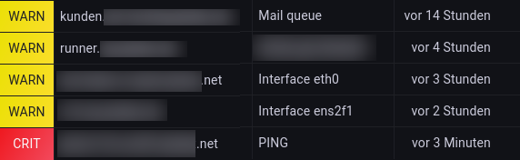

CheckMK Livestatus for Grafana JSON datasource
===============================================

This is a small wrapper that translates queries from the [JSON datasource] for
[Grafana] to [Livestatus] queries for [CheckMK].

When set up and used correctly, you can display live status from CheckMK (e.g.
current service or host problems) on your Grafana dashboard. However, you can
construct almost any Livestatus query using this wrapper.

Note that the time range selected in Grafana is completely ignored.

[JSON datasource]: https://grafana.com/grafana/plugins/simpod-json-datasource/
[Grafana]: https://grafana.com/
[Livestatus]: https://docs.checkmk.com/latest/en/livestatus.html
[CheckMK]: https://checkmk.com/

Example
-------
Metric: `services`
Payload:
```json
{
  "columns": ["hard_state", "host_name", "description", "last_time_ok"],
  "filters": [
    "hard_state > 0",
    "acknowledged = 0",
    "host_state = 0",
    "scheduled_downtime_depth = 0",
    "host_scheduled_downtime_depth = 0"
  ]
}
```

With the Table panel plugin and some styling settings, the output can look like
this:


Installation
------------
Run the following as your OMD user:
```sh
DESTDIR=~/var/www/grafana-livestatus
mkdir -p "$DESTDIR"
curl -L "https://raw.githubusercontent.com/PLUTEX/grafana-livestatus/master/index.php" -o "${DESTDIR}/index.php"
cat > ~/etc/apache/conf.d/grafana-livestatus.conf <<EOF
<Location "/${USER}/grafana-livestatus">
    RewriteEngine on
    RewriteRule search index.php [L]
    RewriteRule query index.php [L]
</Location>
EOF
omd reload apache
```

Then add a new datasource to Grafana using the JSON datasource with the
following settings:

* URL: `https://monitoring.example.org/$USER/grafana-livestatus/`
* Access: Server (Default)
* Basic auth: yes
* User & Password: Some local Check_MK user (e.g. automation)

**SECURITY NOTICE:** Note that while **a** user and password is needed to access
this wrapper, its authorization for hosts and services is not checked!
